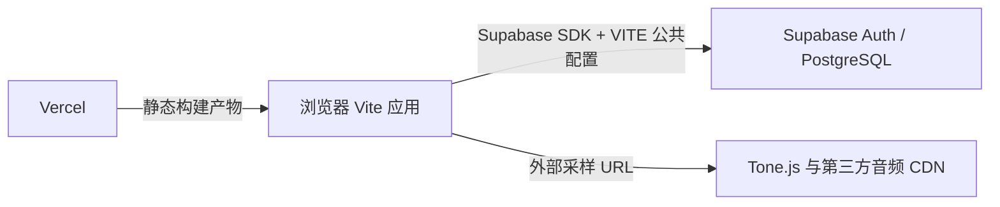
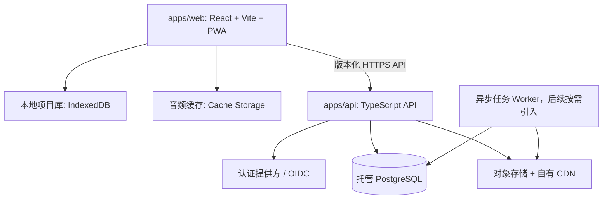

# 第八轮架构与运营审计：长期数据、部署与音频资产

> 状态：已审计，尚未实施。
> 审计日期：2026-07-12
> **项目优先级：P0，先于第八轮算法与 UI 改造执行。**

## 1. 执行结论

当前产品不是可独立运行的传统全栈应用，而是 **Vite 静态前端 + Supabase BaaS**：浏览器直接连接 Supabase Auth 和 `projects` 表，Vercel 仅分发静态构建产物。仓库中没有自有 API、服务端、Vercel Function、容器部署配置或独立的数据服务层。

Supabase 停用后，认证、云项目读取和云端写入同时不可用。这个事件证明当前架构不适合长期运营。

第八轮必须先建立新的运行底座，再进行算法、UI 和交互重构。否则新功能仍会绑定在不可控的数据与音频依赖上，且后续改动需要再次穿透前端核心流程。

### 已锁定决策

- **不迁移旧 Supabase 测试数据。** 新系统从新的数据模型和新的生产库开始。
- **保留 React + Vite 工作台。** 不为了获得后端能力而重写为 Next.js。
- **从“前端直连 BaaS”转为“本地优先客户端 + 自有 API + 托管 PostgreSQL + 受控对象存储/CDN”。**
- **Vercel 可继续承担 Web 前端分发，但不再是唯一运行基础。**
- **音频默认必须零网络首播。** 采样音色是渐进增强，不能阻塞试听。

## 2. 当前架构与已确认失效点



### 2.1 数据与认证

- `src/services/supabaseClient.ts` 在浏览器中读取 `VITE_SUPABASE_URL` 和 `VITE_SUPABASE_ANON_KEY`，直接创建 Supabase 客户端。
- `src/services/projectsRepository.ts` 直接查询和写入 `projects` 表；该表的唯一迁移是 `supabase/migrations/0001_create_projects.sql`。
- 仓库内没有 `api/`、`server/`、`backend/`、Function、Dockerfile、`vercel.json` 或 Supabase 本地配置。
- `.env` 中仍存在 Supabase 配置，但服务不可达时，应用仍会判断为“已配置”。

### 2.2 失败模式

| ID | 严重度 | 已确认问题 | 影响 |
| --- | --- | --- | --- |
| ARC-01 | P0 | Auth 与项目存储共用同一个外部 BaaS 依赖 | 一个服务停用即同时失去登录、读取和写入 |
| ARC-02 | P0 | “有环境变量”被当作“服务可用” | Supabase 不可达时不会自动进入本地工作模式 |
| ARC-03 | P0 | `AuthProvider` 的初始 `getSession()` 没有网络错误降级 | 服务不可达时状态可能停在 `loading`，正式工作区无法正常进入 |
| ARC-04 | P1 | 浏览器直接耦合供应商 SDK、认证与表结构 | 更换数据库、认证或同步策略都要修改前端核心工作流 |
| ARC-05 | P1 | 远端项目只有单个 JSON 快照 | 缺少版本、冲突控制、审计、恢复策略和正式的数据演进 |
| ARC-06 | P1 | 部署和基础设施设置主要在控制台 | 环境、迁移、备份和生产配置不能通过代码完整复现或审查 |
| ARC-07 | P2 | 无健康检查、业务可观测性与恢复演练 | 无法主动识别服务停止、同步失败、备份失效或用户受影响范围 |

### 2.3 现有本地能力的边界

应用已有 IndexedDB `active` 自动保存和 localStorage 偏好保存，但它们不足以承担长期离线能力：

- 只有一个活动草稿，不是多项目本地库。
- 没有离线写入队列、远端版本号、冲突处理或同步状态。
- 已存远端项目不能在 Supabase 停用后以本地项目列表形式继续访问。
- 浏览器本地数据可能被清理或因存储压力失效，不能作为唯一可靠备份。

## 3. 音频资产审计

### 3.1 当前实现

默认钢琴和其他采样音色通过 Tone.js 从两个第三方来源加载：

- `https://tonejs.github.io/audio/salamander/`
- `https://nbrosowsky.github.io/tonejs-instruments/samples/`

默认钢琴包含 20 个采样映射。旋律和和声各自创建一个 `Tone.Sampler`，即使两者使用相同采样表也会分别初始化。当前 `ensureStarted()` 等待 `loadTone()` 完成，而 `loadTone()` 只有在 reverb、旋律 sampler 与和声 sampler 全部加载后才 resolve。因此首次 `previewNote()` 和 `playCandidate()` 会等待完整采样加载。

代码中创建了合成器 fallback，但它在现有首播路径中不能发挥“立即播放”的作用，因为播放前仍等待 sampler 的加载 Promise。

### 3.2 风险

| ID | 严重度 | 问题 | 影响 |
| --- | --- | --- | --- |
| AUD-01 | P0 | 首次试听被远程采样加载阻塞 | 听是产品核心动作，慢首播直接破坏创作闭环 |
| AUD-02 | P0 | 采样资源依赖无 SLO 的第三方 CDN | 与 Supabase 类似，外部资源波动可使核心能力退化 |
| AUD-03 | P1 | 旋律/和声独立初始化相同采样 | 增加请求、解码和内存压力，不能假定缓存一定消除成本 |
| AUD-04 | P1 | 切换音色会销毁并重新加载乐器 | 音色切换造成不必要等待和资源抖动 |
| AUD-05 | P1 | 缺少资源 manifest、许可记录、缓存预算和性能指标 | 无法控制素材来源、体积、版本或长期授权风险 |

## 4. 目标架构



### 4.1 推荐仓库结构

```text
pnpm-workspace.yaml
apps/
  web/             # React + Vite 工作台与 PWA
  api/             # TypeScript API 服务
packages/
  domain/          # 项目、版本、同步、权限领域模型
  contracts/       # API DTO、schema、生成客户端
  harmony-core/    # 可被浏览器和服务端复用的算法核心
infra/
  migrations/      # PostgreSQL 迁移
  deployment/      # 可复现的部署与环境定义
  runbooks/        # 备份、恢复、故障、发布操作手册
```

推荐 API 使用 TypeScript，以复用现有音乐领域类型和降低团队维护成本。具体 HTTP 框架可选轻量 TypeScript 框架；选型标准是 schema 校验、结构化日志、测试友好、长效支持和容器部署能力，而非框架潮流。

### 4.2 数据与同步边界

- 浏览器不再直接访问数据库或供应商表。
- API 管理认证、项目权限、数据校验、版本冲突和审计。
- 项目至少包含 `project`、`project_revision`、`project_change` 三层概念；写入携带 revision，避免静默覆盖。
- IndexedDB 保存多项目本地副本和待同步操作，网络恢复后按幂等请求同步。
- 当前阶段不实现 CRDT 或实时协作；先完成单用户可靠同步、历史和恢复。
- 对重要本地库请求持久化存储，并对配额、清理和失败向用户透明提示。

Cache Storage 适合缓存可通过 URL 获取的音频资源，IndexedDB 适合结构化项目数据；两者应分工而不是混用。

### 4.3 音频资产与首播策略

1. **本地合成器先行。** 用户第一次试听或点按钢琴键时立即使用浏览器内合成器。
2. **采样后台升级。** 高质量采样仅在不阻塞当前播放的情况下加载，完成后从下一次音符触发起平滑接管。
3. **自有资产层。** 将经许可的采样文件放入对象存储和自有 CDN，维护版本化 manifest、内容哈希、体积预算与许可元数据。
4. **按需加载。** 在读到旋律/和声音域后，加载必要的临近采样；避免整套音色预热。
5. **共享缓存与混音。** 同一音色共享解码缓存；旋律/和声通过混音总线或事件参数区分音量，而不是重复下载同一素材。
6. **离线缓存。** 将已使用的音色写入 Cache Storage，设计明确的缓存上限、淘汰和“下载以便离线试听”入口。
7. **可量化验收。** 记录首次可听时间、首播失败率、采样缓存命中率、下载字节数和音色切换耗时。

## 5. 运营能力

### 5.1 数据可靠性

- 托管 PostgreSQL 必须具备自动备份、明确保留期、时间点恢复或等价恢复方案。
- 每季度至少一次恢复演练：从备份恢复到隔离环境，验证项目可读、可保存、可导出。
- 迁移可回滚或至少可前向修复；每次发布在预发布环境验证迁移和 API 合约。
- 不迁移旧测试数据，但新的生产数据从第一天开始有备份和恢复责任人。

### 5.2 可观测性与 SLO

最小可观测性集合：

- `/healthz` 和 `/readyz`。
- API 错误率、延迟、数据库连接与同步队列积压。
- 首次可听时间、算法生成 P95、离线同步失败率、音频缓存命中率。
- 前端异常、发布版本、请求关联 ID、关键业务事件。
- 告警：数据库备份失败、错误率上升、同步连续失败、资源 CDN 失败、存储接近预算。

Vercel 可继续提供 Web 前端、函数与外部 API 调用的基础可观测性；业务指标、告警规则和长期日志归档仍需由应用和监控系统负责。

### 5.3 安全与隐私

- 认证实现基于标准 OIDC/OAuth 或受维护的认证服务，避免自建密码安全体系。
- 会话、权限、速率限制、删除账户、导出数据与审计日志在 API 层集中处理。
- 对象存储只使用短时签名 URL，禁止公开写入。
- 不把数据库高权限密钥、存储密钥或内部 API 密钥打进 Vite 构建产物。
- 制定数据保留、删除和备份恢复政策；根据目标用户所在区域确定数据主存储区域。

### 5.4 交付与成本治理

- 开发、预发布、生产环境分离；每个环境有独立数据库、存储桶和密钥。
- 部署、环境变量名称、迁移和域名/回调配置可审查、可复现，不只存在控制台。
- CI 至少执行类型检查、单元测试、API 合约测试、数据库迁移测试、关键浏览器回归和依赖漏洞检查。
- 设定数据库、对象存储、CDN 音频出网、日志与备份的预算告警。
- 仅将 Vercel Cron 用于可重试、幂等、带锁的维护任务；不将核心数据同步或唯一备份依赖于无重试的 Cron 调用。

## 6. 技术选择边界

| 领域 | 推荐 | 暂不推荐 |
| --- | --- | --- |
| 前端 | React + Vite + PWA | 为后端能力整体重写编辑器 |
| 服务端 | TypeScript API 服务，容器化或等价可控运行时 | 浏览器直连数据库/BaaS 表 |
| 数据库 | 托管 PostgreSQL + 明确备份恢复 | 再次把唯一数据源绑定在可暂停的免费实例 |
| 文件与音频 | S3 兼容对象存储 + 自有 CDN | 关键采样依赖匿名第三方 CDN |
| 项目状态 | IndexedDB 多项目库 + 同步队列 | 单一 `active` 自动保存作为唯一离线方案 |
| 算法执行 | 现阶段客户端确定性生成，可共享核心 | 立即上云端长任务、队列或实时协作 |
| 协作 | 暂不实现 | 过早 CRDT、WebSocket、多区域写入 |

Vercel Functions 支持 Node.js、Go、Python 等运行时，可承担轻量 API 或边缘辅助工作；是否将主 API 放在 Vercel，应由任务时长、连接模型、成本和运维边界决定，而不是因为前端已经托管在 Vercel 就默认绑定。

## 7. 第八轮执行顺序

以下顺序取代“先算法、再 UI、再部署”的原定顺序：

1. **A0：锁定长期架构与运营责任。** 确定运行区域、部署模型、数据库服务、对象存储、认证与预算边界；不涉及旧数据迁移。
2. **A1：建立工作区与基础设施。** 新建 monorepo 边界、环境隔离、迁移框架、健康检查、CI、日志与告警基础。
3. **A2：建立本地优先项目库与 API。** 多项目 IndexedDB、项目版本、同步协议、认证和 PostgreSQL 新库。
4. **A3：重建音频资源层。** 零网络首播、渐进采样、自有资产、缓存和性能指标。
5. **A4：切换前端依赖。** 移除 Supabase 直连、接入自有 API 与同步状态，并提供服务不可用时的本地模式。
6. **A5：重新验证生产基线。** API、数据库恢复、同步、音频首播、离线工作和部署回滚演练。
7. **A6：算法重构。** 在稳定的项目/版本模型上实施乐句、终止、连续风格与统一配声。
8. **A7：UI 重构。** 在稳定数据和算法输出上实施两阶段工作台、Chord Track 与新视觉系统。

算法与 UI 审计结论继续有效，但它们的实现依赖 A0–A5 完成。设计任务可在并行的原型层推进，不得直接大规模改动现有生产工作台主分支。

## 8. 验收口径

- Supabase 完全不可用或未配置时，用户仍可进入本地工作区、创建多个项目、试听、生成、导出并看到明确离线状态。
- 浏览器不含数据库高权限凭据，也不直接调用供应商数据库表。
- 新项目可保存、版本化、离线修改并在网络恢复后同步；冲突不会静默覆盖。
- 任何生产项目有可验证的最近备份；恢复演练可在既定时间内完成。
- 默认音色首次播放不依赖网络，不等待采样下载。
- 已使用采样可在离线状态下再次试听，缓存失败不会阻止 fallback 播放。
- API、同步、音频和数据库的核心指标可监控、可告警、可定位到发布版本。
- 所有部署与环境边界可从仓库和受控密钥系统复现。

## 9. 参考资料

- [PostgreSQL: Backup and Restore](https://www.postgresql.org/docs/current/backup.html)
- [web.dev: Offline data and persistent storage](https://web.dev/learn/pwa/offline-data)
- [Vercel: Configuring Functions Runtime](https://vercel.com/docs/functions/configuring-functions/runtime)
- [Vercel: Managing Cron Jobs](https://vercel.com/docs/cron-jobs/manage-cron-jobs)
- [Vercel: Observability](https://vercel.com/docs/observability)
