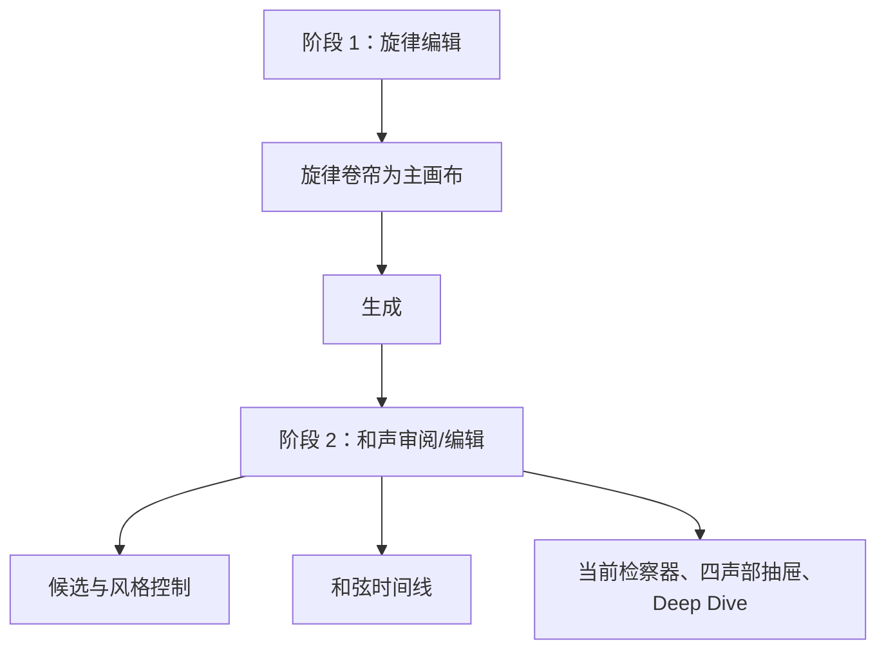

# 第八轮 UI/UX 审计：两阶段工作台、信息密度与 Apple 式编辑体验

> 状态：已审计，尚未实施。
> 审计日期：2026-07-12
> 范围：工作台的信息架构、和声阶段、钢琴卷帘、控制收纳、视觉系统与响应式体验；不包含本轮算法或部署改造的实现。
>
> **执行依赖：** 本文件的生产实现排在 [01-architecture-audit.md](01-architecture-audit.md) 的 A0–A5 之后。可以先做视觉原型，但不得在旧的 Supabase 直连和旧音频资源边界上继续叠加主工作流。

## 1. 审计目的与结论

本文件是后续 UI 任务细分的事实基线，记录已由当前源码、已验证截图和产品反馈确认的界面问题与约束。它不是实现清单，不应被直接当作逐文件修改说明。

当前工作台的问题并不等于“二阶段逻辑错误”。相反，**旋律编辑 → 和声审阅/编辑**的阶段划分应当保留。真正的问题是第二阶段没有完成视觉重心切换：旋律卷帘、候选卡、深度信息、声部抽屉和检察器同时存在，使和弦编辑没有成为主任务。

本轮的目标是把当前“深黑色、全信息常驻的音乐工具”调整为更接近 Apple 产品工具的体验：明亮、通透、层级明确、控件克制、上下文按需出现。这里的“Apple 式”不意味着复制 iOS 或使用固定系统蓝，而是指清晰材料层级、可预期交互、低认知负担和高质量细节。

## 2. 审计依据

### 2.1 已审阅工件

- 当前工作台源码：`src/app/App.tsx`、`src/app/App.css`、`src/styles/global.css`、各 workspace 组件。
- 已验证桌面截图：`dist/t4-desktop-verify.png`，1440 × 980。
- 已验证移动端截图：`dist/t4-mobile-verify.png`，390 × 900。
- 现有浏览器回归脚本：`scripts/verify-t4.mjs`。

### 2.2 当前结构



阶段 1/2 的状态已存在：`inHarmonyPhase` 与 `editOverride` 控制旋律编辑与和声视图。问题是阶段 2 的实现仍然保留了大面积旋律编辑区，并额外叠加多种和声信息层，导致画布、交互和阅读目标相互竞争。

## 3. 已确认问题

| ID | 严重度 | 问题 | 证据 | 用户影响 |
| --- | --- | --- | --- | --- |
| UI-01 | P0 | 第二阶段没有真正“以和声为主” | 和声阶段同时出现顶部三档选择、三张候选卡、Deep Dive、旋律卷帘、底部和声抽屉和固定右侧检察器 | 用户进入和声阶段后，仍不能自然地聚焦和弦进行与其时间关系 |
| UI-02 | P0 | 现有离散风格控件与连续风格要求冲突 | `CommandBar` 和 `CandidateStrip` 都展示 Stable / Pop / Color 三档 | 连续滑动条上线后会产生重复、相互矛盾的入口与语义 |
| UI-03 | P0 | 底部抽屉暴露了默认不需要的具体配声 | 当前抽屉显示 Bass / Lower / Middle / Upper 和 `C2 · C3 · E3 · G3` 等音高 | 用户想看和弦进行时被实施层面的声部细节打断 |
| UI-04 | P1 | 生成上下文被粗略收纳在“设置”中 | 调性、调式、速度、拍号、节奏等高频参数位于 `details` 菜单，且菜单关闭时不展示当前值 | 用户无法快速确认生成条件，设置和生成之间缺乏可见联系 |
| UI-05 | P1 | 顶栏承担过多、不同频率的任务 | 语言、演示、登录、引导、风格、设置、生成并列出现 | 高优先级创作动作和低频账户/帮助动作争夺注意力 |
| UI-06 | P1 | 检察器职责过度且常驻 | 当前右栏同时承载解释、声部、替代和弦、复制和导出 | 编辑画布宽度被固定占用；导出等项目级动作错误地附着在单和弦上下文中 |
| UI-07 | P1 | 钢琴卷帘的音符视觉和拖拽反馈不平滑 | 音符使用高对比白色渐变胶囊；拖动按 0.5 拍硬吸附，并在每次 pointer move 时直接更新应用状态 | 音符显得生硬，拖动容易感到跳动，缺少专业编辑器的连续预览 |
| UI-08 | P1 | 当前默认视觉系统压抑且与新方向不一致 | `global.css` 使用纯黑 `oklch(0 0 0)` 与纯白；既有 UI 文档仍把工作台定义为黑色奢侈画廊 | 长时间编辑时对比过强、空间不通透；设计方向无法稳定执行 |
| UI-09 | P2 | 移动端虽无明显横向溢出，但创作层级失效 | 390px 截图中顶部控制变成连续多行，候选、卷帘、和弦抽屉和检察器纵向堆叠 | 用户需要很长滚动才能抵达当前主要工作，移动端更像完整桌面页压缩 |
| UI-10 | P2 | 状态和 CSS 覆盖层累积 | `App.tsx` 约 1664 行、`App.css` 约 3183 行，存在 `is-expert`、`is-harmony-phase`、`is-deep-dive` 等多层覆盖 | 后续继续局部补丁会增加布局回归风险，难以保持组件状态一致 |

## 4. 已确认的两阶段工作台规则

### 4.1 保留阶段划分

不得将工作台重新合并成一个“所有信息常驻”的单页面。保留以下两种明确模式：

| 阶段 | 主任务 | 主画布 | 默认可见内容 | 默认隐藏/弱化内容 |
| --- | --- | --- | --- | --- |
| 旋律编辑 | 导入、录入、移动、调整旋律 | 钢琴卷帘 | 输入方式、必要生成上下文、撤销/删除、播放 | 和弦候选、和弦详情、配声、导出 |
| 和声审阅/编辑 | 听、比较、选择和调整和弦结果 | 和弦进行时间线 | 当前方案、连续风格值、播放、Chord Track、终止/状态提示 | 旋律编辑工具、具体配声、完整理论长文 |

阶段切换必须是用户可理解的显式动作：生成成功后进入和声阶段；“编辑旋律”可返回阶段 1，返回后恢复完整卷帘和编辑工具。切换不是同页堆叠更多区域。

### 4.2 和声阶段的正确层级

```text
+------------------------------------------------------------------+
| 项目名 / 返回编辑旋律                     生成上下文 / 重新生成 |
+------------------------------------------------------------------+
| 旋律参考轨（只读、紧凑、可展开）                               |
+------------------------------------------------------------------+
| 当前方案  ·  风格滑动条  ·  播放/暂停  ·  终止状态              |
+------------------------------------------------------------------+
|                                                                  |
|                  Chord Track / 和弦进行主画布                   |
|                                                                  |
+------------------------------------------------------------------+
| 可折叠底部抽屉：仅 Chord（C · Am/C · Fmaj7 …）                  |
+------------------------------------------------------------------+
| 按需打开：当前和弦的解释、替代和弦、完整声部、导出详情          |
+------------------------------------------------------------------+
```

上图描述的是信息优先级，不固定具体像素或视觉实现。

## 5. 底部抽屉规则：只显示 Chord

这是本轮已锁定的产品规则。

### 默认内容

- 抽屉是一个简洁的 **Chord Track**，按时间显示 `C`、`Am/C`、`Fmaj7` 等和弦名称。
- 点击某个 chord 可选择它、播放对应位置或打开详情。
- 和弦名称是唯一默认文本。Roman numeral、功能标签和说明不与和弦名称并列常驻。

### 默认不显示的内容

- Bass / Lower / Middle / Upper 四行。
- `E2`、`C2 · C3 · E3 · G3` 等具体音高与具体声部标签。
- 作为背景细节的四声部可视化。

### 信息去向

| 信息 | 默认位置 |
| --- | --- |
| 和弦名称 | 底部 Chord Track |
| Roman numeral、功能、旋律关系、终止解释 | 选中 chord 后的按需检察器 |
| 替代和弦 | 选中 chord 后的上下文操作 |
| 完整配声与具体音高 | 后续独立“配声视图”或按需详情，不进入默认抽屉 |
| MIDI 导出、复制进行 | 项目级结果操作，不绑定到常驻单和弦检察器 |

## 6. 连续风格控制对 UI 的影响

算法审计已确认风格需要是连续滑动条，而不是三个固定档位。因此：

- 删除或重构顶栏的三段式 `harmony-style-control`。
- 不再把候选卡标题等同于 Stable / Pop / Color 风格入口。
- 风格控制在和声阶段只保留一个连续、可读的滑动条，展示当前值及两端语义，例如“功能清晰”与“色彩张力”。
- 候选比较若继续存在，应比较不同的**和声路径/结果**，而不是伪装成固定风格预设；其展示必须服务试听和选择，而不是重复当前方案。
- 乐句终止意图与风格值分离。完整终止、继续、半终止、循环等属于结果意图，不能被高色彩值隐藏。

## 7. 视觉系统纠偏

### 7.1 需要废止的默认假设

- 纯黑背景是专业工具的默认答案。
- 高亮白色胶囊、粗黑白对比和大面积暗玻璃能够减轻信息密度。
- 工作台应延续奢侈画廊/舞台的戏剧性。

上述假设更适用于落地页或空状态，不适用于连续编辑和试听。

### 7.2 新的视觉目标

- 默认采用明亮、低饱和、中性偏冷或微暖的工作台表面，避免纯白和纯黑。
- 使用清晰但克制的层级：页面底色、工作台底色、轻抬升的上下文面板、选中状态。
- 只使用一个有限的强调色，服务生成、播放、选中和键盘焦点，不作为装饰噪声。
- 正文和控件使用系统无衬线字体；展示字体只限品牌/落地页或极少数非工作流标题。
- 采用接近 Apple 的紧凑控件、适度圆角、细分割线和柔和阴影，但不以玻璃拟态或蓝色渐变替代信息层级。

### 7.3 钢琴卷帘与音符组件

- 音符应从白色“瓷器胶囊”改为低对比、轻圆角的实体块，选中与播放使用明确但不刺眼的状态变化。
- 拖拽过程中应显示临时预览、对齐线与吸附位置；指针释放后再提交最终数据，避免每次移动都触发全局状态更新。
- 保持可配置的节拍吸附，但视觉上允许连续移动并清晰显示最终落点。
- 编辑阶段可保留完整音高范围；和声阶段的旋律只读参考轨应缩小，不再承担完整编辑任务。

## 8. 控制与信息收纳规则

### 顶栏

顶栏只保留项目级、高频、全局动作：项目身份、返回/项目菜单、必要账户入口和生成动作。语言、引导、低频演示与数据清理不得与生成动作等权并列。

### 生成上下文

调性、调式、拍号、速度、节奏模式与连续风格值组成可见但可收起的“生成上下文”。收起后仍需摘要展示当前有效值，不能只剩“设置”二字。

### 检察器

检察器改为按需侧栏、浮层或局部详情。默认仅显示当前 chord 的必要信息；替代和弦、完整解释和配声详情通过渐进披露出现。不可在和声阶段永久占用主画布宽度。

### 菜单

- “加载示例”“加载长示例”可作为开发/学习入口。
- “清除本地数据”是破坏性动作，不能与示例加载混在同一无提示小菜单中。
- 高频编辑命令需要直接可见或有清晰键盘入口，不应依赖“更多”菜单发现。

## 9. 后续任务的验收口径

- 阶段 1 首屏中，钢琴卷帘是唯一明显主画布，且所有旋律编辑操作无需进入二级菜单。
- 阶段 2 首屏中，Chord Track 是唯一明显主画布；旋律仅作为紧凑只读参考，不挤占主体高度。
- 底部抽屉默认只显示 chord 名称，不显示任意具体配声音高或四声部行。
- 连续风格滑动条是唯一风格入口；不保留三档风格按钮或同义候选卡。
- 生成上下文在收起与展开两种状态下均可识别当前值。
- 选中 chord 后能在不离开当前和弦画布的前提下查看解释和替代方案；未选择时不显示冗余长文。
- 拖动音符时有连续视觉预览与清晰吸附反馈；提交时机和状态更新不会造成可感知跳动。
- 桌面和移动端均按“主任务优先”折叠，而不只是避免横向溢出。
- `UI_UX_DESIGN.md` 需在后续方向确认后整体改写，不能继续保留与新工作台方向冲突的“黑色奢侈画廊”默认定义。

## 10. 审计结论

本轮不应把工作台回退为单一页面，也不应在当前布局上继续增加折叠面板。正确路径是保留阶段分工，并让每个阶段只有一个明确主画布：阶段 1 是旋律卷帘，阶段 2 是 Chord Track。

底部抽屉的角色已明确为简洁的和弦时间线，而不是默认的四声部配声展示。具体音高与声部结构保留给按需详情或未来专业配声视图。与算法连续风格控制同步，三档风格 UI 也必须从产品界面中退出。
